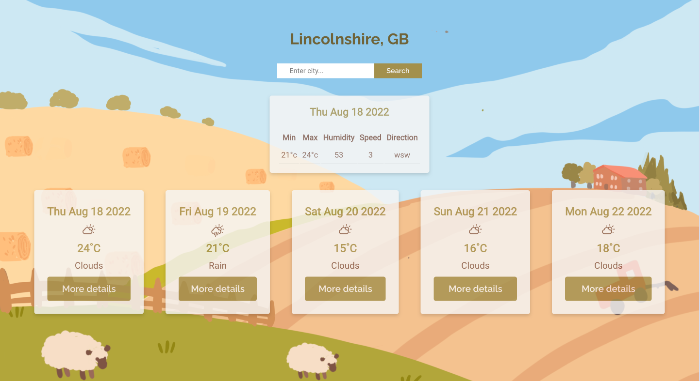
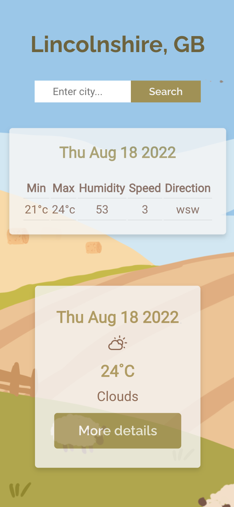
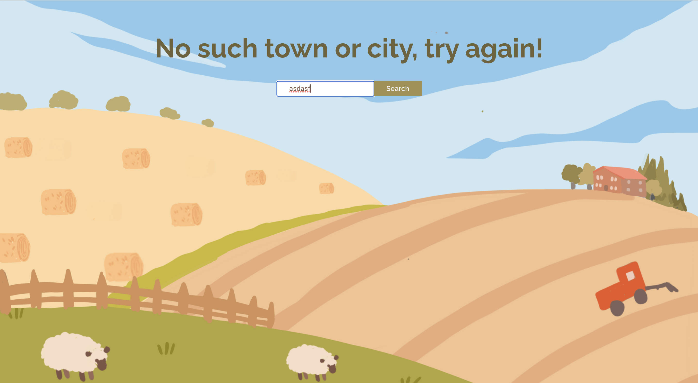

# :sunny: Weather App :cloud:
A project that applies the REACT framework to create a 5 weather forecast app using the Manchester Codes Weather App API.

From [Manchester Codes](https://www.manchestercodes.com/?utm_source=google&utm_medium=cpc&utm_campaign=973925948&utm_content=nocsdegree_Matt&utm_term=manchester%20codes&utm_term=manchester%20codes&utm_campaign=Sep+21+-+Brand+Campaign&utm_source=adwords&utm_medium=ppc&hsa_acc=4219584815&hsa_cam=973925948&hsa_grp=51195941914&hsa_ad=395486348780&hsa_src=g&hsa_tgt=aud-1170118835214:kwd-380100275891&hsa_kw=manchester%20codes&hsa_mt=e&hsa_net=adwords&hsa_ver=3&gclid=CjwKCAjwgr6TBhAGEiwA3aVuIcdO0_D7Lg4Ig9TGkcehWDN0yCzw2ANDmh5m4TzfMPSSWMuOD0UZDRoCkbEQAvD_BwE) Software Engineering Fast Track Programme.

# CONCEPTS
* React
* JSX
* Props
* Props Validation
* State
* Stateful Components
* Stateless (presentational) components
* React Hooks
* React Testing Library
* Request/Response
* Error Handling

# PROJECT DETAILS
To access the deployed version [Link to Deployed Version](https://chrissyelwes.github.io/weather-app/)
If everything looks wonky, make sure to zoom out using your browser settings.

Input any UK city in the search bar to find out the 5 weather forecast for that location.
Clicking the "More details" button will show you more details for each city.

# VISUALS

# PROJECT STATUS
Finished!